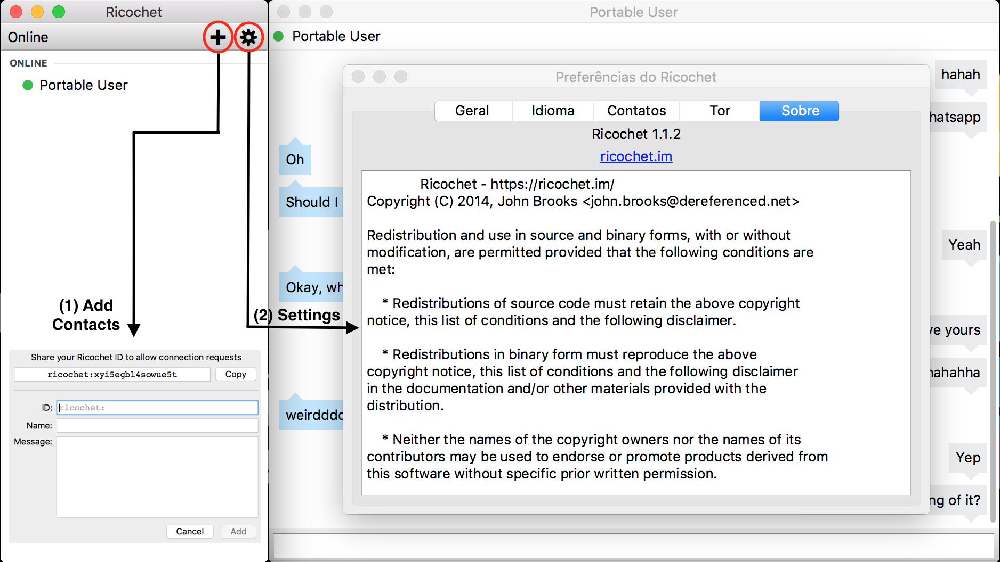

## Ricochet
By [Alberto Passini](https://github.com/AlbertoPassini), [Amanda Fernandes](https://github.com/amandafer/) and [Tamiris Bastos](https://github.com/tatasb)

*Ricochet is an instant messenger tool that deals with the core problem of metadata.
The concept of this IM is to message without any servers in the middle. Meaning, without trusting your data to anything so it can forward your messages to your contacts.*

### Table of Contents

### Introduction
Created by John Brooks in 2010, Ricochet (previously Torsion) was a program for encrypted instant messaging that uses TOR hidden services for the protected transmission of communications. However, it only got user's attention in 2014, after Edward Snowden’s revelations about the government’s intrusive surveillance activities.

To achieve true peer-to-peer connectivity, the hard work is done by a hidden service architecture named TOR. The user’s Ricochet address (i.e. `ricochet:rs7ce36jsj24ogfw`) represents a public key and a hidden service, and through TOR peers can ask to connect to you. Both sides make an anonymous connection to a rendezvous relay, and messages are sent through that connection. The address identifies a public key, which encrypts all of that communication.

The project was developed using C++ and Qt, a cross platform software. The interface was built with QML, a declarative UI language derived from javascript.
In this chapter, the insights of the Ricochet project are given. We will give some background on the different stakeholders and architectural view and perspectives.

##### Main Features
Ricochet is an experimental kind of instant messaging that doesn't trust anyone with your identity, your contact list, or your communications.
* You can chat without exposing your identity (or IP address) to anyone
* Nobody can discover who your contacts are or when you talk (metadata-free)
* There are no servers or operators that could be compromised, exposing your information.
* It's cross-platform and easy for non-technical users.

Similar to any instant messaging application, Ricochet has on the right a list of your contacts and their status. As for the left, and majority part of the window, the conversation with a particular contact is shown. the connection between the application and TOR is given at the beginning, when the user opens Ricochet.

The figure below illustrates the software working, plus the windows Add Contact and Settings opened for visualization.

Figure 01: Features of Ricochet application

By clicking at the `+` button, other Ricochet users can be added. With that, a new window will appear (1) Add Contacts, as shown in Figure 01. The user’s Ricochet ID appears at the top of the window, this allow others to add you as a contact. In the ID field, the contact’s Ricochet ID, whom you wish to add, must be entered. The name field is the name you choose for your contact and the message field is optional. However, it is useful to let the contact to know who is the person requesting to connect, since the app will only show the Ricochet ID.

When your contact comes online, they will see a new window with your Ricochet ID and your message, if you chose to give one. They will not know who you are unless you have told them using a different medium. The added contact will have the option to accept or refuse your request to connect. If they reject the message, you will not be able to see that their status nor be able to communicate with them using Ricochet. Once your contact accepts your message, and if they are online, you will be able see them as online, and will be able to start a new conversation with them.

In case the IM window is closed, the conversation history will be gone. When a contact closes Ricochet, the client window will show them as offline.

The settings window can be used to change the application configuration, besides managing contacts.

##### Benefits and warnings
Some of the benefits about the privacy provided by Ricochet:
* Users are not personally identifiable, neither has IP addresses or physical locations revealed because of TOR.
* Message content is cryptographically authenticated and private.
* There is no need to register anywhere in order to use Ricochet, particularly with a fixed server.
* Contact list information is stored locally, and it would be very difficult for passive surveillance techniques to determine whom you’re chatting with.
* Ricochet does not save chat history. When a conversation is closed, the chat log is not recoverable.
* The use of Tor hidden services prevents network traffic from ever leaving the Tor network, thereby preserving anonymity and complicating passive network surveillance.
* Ricochet is a portable application, users do not need to install any software to use Ricochet. Ricochet connects to the Tor network automatically.

Even though Ricochet presents a secure connection and cryptographed chat, the following warnings must be take into consideration:
* An already-compromised computer system will typically defeat the privacy protections that Ricochet offers, such as a keystroke logging malware.
* Even though Ricochet uses TOR, other applications will not be using Tor unless you’ve independently set up additional TOR services on your computer.
* Active and passive surveillance techniques can still tell if you’re using the Internet, and when, but not necessarily what you’re doing on the Internet.
* Since a Ricochet user does not register or log in anywhere to use the application, it is important to implement layered physical security, including disk encryption, to protect Ricochet.
* Tails Linux users, and other live operating systems users, can optionally backup Ricochet to zero-knowledge cloud services such as SpiderOak, or on a personally owned USB drive (ideally encrypted).

### Development team and contributions

### Releases and possibles improvements

### Used frameworks and development tools

### Architecture

### References
1. https://github.com/ricochet-im/ricochet
2. https://www.torproject.org/docs/hidden-services.html.en
3. https://yawnbox.com/index.php/category/ricochet/
4. http://technofaq.org/posts/2014/06/chat-anonymously-and-serverlessly-with-torsion/
5. https://www.wired.com/2014/09/new-encrypted-chat-program-thwarts-nsa-eliminating-metadata/
6. http://motherboard.vice.com/read/ricochet-encrypted-messenger-tackles-metadata-problem-head-on
