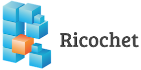
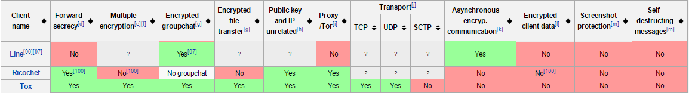

## Ricochet
**By [Alberto Passini](https://github.com/AlbertoPassini), [Amanda Fernandes](https://github.com/amandafer/) and [Tamiris Bastos](https://github.com/tatasb)** 
*Federal University of Minas Gerais, 2016.*

*Ricochet is an instant messenger tool that deals with the core problem of metadata.
The concept of this IM is to message without any servers in the middle. Ricochet accomplishes this by not trusting your data to any third party software, whenever your messages are forward to your contacts.*

### Table of Contents
1. [Introduction](#introduction-)
  1. [Main Features](#main_features-)
  2. [Benefits and warnings](#benefits_warnings-)
2. [Development Team and Contributions](#development-)
  1. [Stakeholders](#stakeholders-)
  2. [Competitors](#competitors-)
3. [Releases and Possibles Improvements](#releases)
4. [Frameworks and Development Tools](#frameworks)
  1. [TOR](#tor-)
  2. [Qt](#qt-)
  3. [OpenSSL](#openssl-)
  4. [Transifex](#transifex-)
5. [Architeture](#architecture-)
  1. [Components Diagram](#components-)
  2. [Use Case Diagram](#use_case-)
6. [Conclusion](#conclusion-)
7. [References](#references-)

### Introduction 
Created by John Brooks in 2010, Ricochet (previously Torsion) was a program for encrypted instant messaging that uses TOR hidden services for the protected transmission of communications. However, it only got users' attention in 2014, after Edward Snowden’s revelations about the government’s intrusive surveillance activities.

To achieve true peer-to-peer connectivity, the hard work is done by a hidden service architecture named TOR. The user’s Ricochet address (`ricochet:rs7ce36jsj24ogfw`) represents a public key and a hidden service, and through TOR peers can ask to connect to you. Both sides make an anonymous connection to a rendezvous relay, and messages are sent through that connection. The address identifies a public key, which encrypts all of that communication.

The project was developed using C++ and Qt, a cross platform software. The interface was built with QML, a declarative UI language derived from javascript.

In this chapter, we will provide insights into the Ricochet project's architectural perspectives, and give background on the different stakeholders.

#### Main Features 
Ricochet is an experimental type of instant messaging that does not trust anyone with your identity, your contact list, or your communications.

* You can chat without exposing your identity (or IP address) to anyone.
* Nobody can discover who your contacts are or when you talk (metadata-free).
* There are no servers or operators that could be compromised, exposing your information.
* It is cross-platform and easy for non-technical users.

Similar to any instant messaging application, Ricochet has on the right a list of your contacts and their statuses. As for the left, the majority part of the window, the conversation with a particular contact is shown. The connection between the application and TOR is displayed at the beginning, when the user opens Ricochet.

The figure below illustrates the software working, plus the windows "Add Contact" and "Settings" opened for visualization.

Figure 01: Features of Ricochet application

By clicking the `+` button, other Ricochet users can be added. For that, a new window will appear: (1) "Add Contacts", as shown in Figure 01. The user’s Ricochet ID appears at the top of the window; this allow others to add you as a contact. In the ID field, the Ricochet ID of the contact you wish to add must be entered. The name field is the name you choose for your contact and the message field is optional. However, it is useful to let the contact to know who is the person requesting to connect, since the app will only show the Ricochet ID.

When your contact comes online, they will see a new window with your Ricochet ID and your message, if you chose to give one. They will not know who you are unless you have told them using a different medium. The added contact will have the option to accept or refuse your request to connect. If they reject the message, you will not be able to see their status nor be able to communicate with them using Ricochet. Once your contact accepts your message, and if they are online, you will be able see them as online, and will be able to start a new conversation with them.

In the case that the IM window is closed, the conversation history will be gone. When a contact closes Ricochet, the client window will show them as offline.

The "Settings" window can be used to change the application configuration, along with managing contacts.

#### Benefits and Warnings 
Some of the benefits of the privacy provided by Ricochet:
* Because of TOR, users are not personally identifiable; neither has IP addresses or physical locations revealed.
* Message content is cryptographically authenticated and private.
* There is no need to register anywhere in order to use Ricochet, particularly not with a fixed server.
* Contact list information is stored locally, and it would be very difficult for passive surveillance techniques to determine whom you are chatting with.
* Ricochet does not save chat history. When a conversation is closed, the chat log is not recoverable.
* The use of TOR hidden services prevents network traffic from ever leaving the Tor network, thereby preserving anonymity and complicating passive network surveillance.
* Ricochet is a portable application; users do not need to install any software to use Ricochet. Ricochet connects to the TOR network automatically.

Even though Ricochet presents a secure connection and cryptographed chat, the following warnings must be taken into consideration:

* An already-compromised computer system will typically defeat the privacy protections that Ricochet offers, such as a keystroke logging malware.
* Even though Ricochet uses TOR, other applications will not be using TOR unless you have independently set up additional TOR services on your computer.
* Active and passive surveillance techniques can still tell if you are using the Internet, and when, but not necessarily what you are doing on the Internet.
* Since a Ricochet user does not register or log in anywhere to use the application, it is important to implement layered physical security, including disk encryption, to protect Ricochet.
* Tails Linux users, and other live operating systems users, can optionally back up Ricochet to zero-knowledge cloud services such as SpiderOak, or on a personally owned USB drive (ideally encrypted).

John Brooks, main creator of Ricochet, once made a statement about the risks of anonymity [7]:
> “Ricochet is an experiment. Security and anonymity are difficult topics, and you should carefully evaluate your risks and exposure with any software.”

### Development Team and Contributions 
Most development and contributions are made through the GitHub platform. The open source project counts on numerous users that help with its growth. Below, the main contributors and competitors are identified [2].

#### Stakeholders 
* Development
  - John Brooks (@special) <john.brooks@dereferenced.net>

* Sponsors
    - Blueprint for Free Speech https://blueprintforfreespeech.net/
    - invisible.im group

* Translations
  - Bulgarian - ivopetkovcz
  - Czech - Einfach
  - Danish - Mikkel Kroman
  - Dutch - mijnheer, Meternalf
  - Finnish - reviewjolla
  - French - rike, Creaprog, CrumpyGat, Jordi, franck99
  - German - djsmith85, rike
  - Italian - HostFat, GIANNAT
  - Polish - Kacper Kołodziej
  - Portuguese (Brazil) - swperman
  - Russian - vla8752, qualte
  - Spanish - strel
  - Swedish - rawtaz
  - Tagalog - taskmaster
  - Turkish - cbolat, basarancaner
  - Ukrainian - l3rixon, nergal

* Thanks
  - Helder Ribeiro (@obvio171) - "Ricochet"
  - Robin Burchell (@rburchell)
  - prof7bit (TorChat) - Inspiration
  - Patrick Gray - invisible.im
  - Suelette Dreyfus
  - HD Moore
  - The Grugq
  - Lawrence Eastland - "R" icon

* Cryptographic Software
  - Eric Young - (eay@cryptsoft.com)
  - Tim Hudson - (tjh@cryptsoft.com)

An overview of what has contributed to the creation of Ricochet is shown below:

#### Competitors 
Many online chats use end-to-end encrypted messages. However, only a few of them focus on a proper, secure way of maintaining anonymity. Ricochet is one of those projects that deals with the core problem of metadata, but there are also a few others to be considered.

* **Tox:** this messenger is the main competitor of the application Ricochet. It is a peer-to-peer instant messaging and video calling protocol that offers end-to-end encryption.  Contrary to Ricochet, Tox relies on a *Distributed Hash Table* for peer discovery and has voice/video calls as a priority.

* **Ring:** another serverless application, Ring is an open-source SIP-compatible softphone and instant messenger that does not require any central servers. Ring is based on a MVC model, with a daemon and a client communication. The daemon handles all the processing, including communication layer (SIP/IAX), audio capture and playback.

* **Whatsapp, Facebook Messenger and Line:** these applications use end-to-end encrypted messages, although they do not focus on anonymity. Line is a proprietary application for instant communications on electronic devices and conducts free VoIP conversations and video conferences. It was heavily used by countries where censorship exists, like China. The major advantage of Line is the possibility to create "Hidden Chats," giving the user the ability to set a timer after which messages disappear from both involved devices and Line servers.

It is possible to analyse the comparisons between the applications with the image below. The complete version can be found on the website referenced by [5].

### Releases and Possibles Improvements 
The program has eight available versions as of the present date (October 2016). The main and new features of each release will be discussed shortly in this section. In the next figure [15], the additions and deletions per week are shown. The gap between the old project and the beginning of what would become Ricochet represents the difficulty of retaining and gaining users prior to 2014. After that, between all releases, a lot of features were added, which is also reflected by the increased size of the project.

The peaks of the above figure correspond to the releases of the Ricochet project. The numbered peaks are explained one by one below.

1. **Torsion 1.0.0**:
This was the very first version of the system and implemented a “real-world,” decentralized and anonymous messaging client for TOR. The last release was on 23 March 2014.

2. **Torsion 1.0.1**:
On the website they express gratitude to some contributors like HostFat and delineate the fixes and features of the program.
The following additions were made: a static Linux build running without dependencies, an Italian translation, a security update to OpenSSL 1.0.1g, possibility to open or copy an URL's from the chat and compatibility with older OS X versions. Additionally, the display of hidden service state was fixed and it became possible to use the system on Linux, OS X and Windows.

3. **Ricochet 1.0.2**:
This was the first version of the program with the final name Ricochet, which was suggested by the contributor `@obvio171`. The changes were minimal in this version, but some did occur: characters were displayed correctly in the chat, a Spanish translation was added and packages were updated.

4. **Ricochet 1.0.3**:
In this version, an excellent improvement on the security was achieved with the update of TOR. This new version prevented the anonymous attack on users of hidden services. Also, more translations were added like Danish and Brazilian Portuguese and the configuration was changed to make the program more flexible, useful, robust and reliable.

5. **Ricochet 1.0.4**:
This release focused on bug corrections to fix common errors in the system. As an example, the error “Configuration is already in use" would appear when the program rebooted unexpectedly. Along with the previous versions, some additions were made within the documentation and translations.

6. **Ricochet 1.1.0**:
This was a major release, switching the environment to a safer and more extensible protocol, and adding brand new icons and including 11 new language translations. It also included many UI fixes, as well as security updates for TOR and OpenSSL. The most differential change made in this release was the incompatibility with the new version and older ones. This update forced users to migrate to the newer version in order to maintain their chats and contacts. The migration could be done through the system itself, in time to use it.

7. **Ricochet 1.1.1**:
This version included bug corrections, updates and additional features. Some of the new features were: choosing the language after the installation, being able to visualize the number of unread messages and the systems ability to play sounds when messages were received.

8. **Ricochet 1.1.2**:
This is the latest version and it can clearly be seen that large improvements have been made. For instance, the reliability and stability of connections were refined. This can be proven, because now contact users with suspicious names are blocked and it does not allow attempts to connect or disconnect users.

As we see, the design described is close to the simplest implementation possible. For future improvements, the protocol has the potential to be extended to enable features such as file transfer or even voice/video streaming. A more advanced use of hidden services could also be implemented and would mitigate the risks of publishing a publicly connectable service. Separate services or more elaborate designs could be used to prevent attacks by non-contacts. Also, future development in TOR could improve the cryptography and principles behind hidden services.

### Frameworks and Development Tools 
The main tools used to make the Ricochet system are TOR, Qt, OpenSSL and Transifex. The backend system is primarily written in C++ and the interface in QML. In this section, we will discuss more each one of the used tools and their importance to the project.

#### TOR 
TOR uses Onion Router as an Internet networking protocol designed to anonymize the data relayed across it. The software makes it possible for users to hide their locations (and their IP addresses), as well as making it difficult for any snoops to see the user’s online activity.

The Ricochet system uses TOR hidden services to create a connection between users. The TOR network runs through the computer servers of thousands of volunteers spread throughout the world. The data is bundled into an encrypted packet when it enters the network, and unlike normal internet connections, part of the packet's header is removed. The removed part, which contains the addressing information, can be used to gather information about the sender, hence why its removal is important. Finally, TOR encrypts the rest of the addressing information. The modified and encrypted data packet is then routed through many of these servers to its final destination.

A hidden service needs to advertise its existence in the Tor network before clients will be able to contact it. Therefore the service randomly picks some relays, builds circuits to them, and asks them to act as *introduction points* by telling them its public key. By using a full TOR circuit, it is hard for anyone to associate an introduction point with the hidden server's IP address. While the introduction points are told the hidden service's identity (public key), we do not want them to learn about the hidden server's location (IP address).

The picture below exemplify the use of a working Transifex system[16]:

#### Qt 
Qt is a cross-platform application development framework for desktop, embedded and mobile; it is written in C++ and used for creation of an application’s frontend. Qt is not a programming language on its own, therefore QML (Qt Meta Language) was used on Ricochet to design the user interface.

QML is a user interface markup language. It is a JSON-like declarative language for designing user interface–centric applications. Inline JavaScript code handles imperative aspects. QML is mainly used for mobile applications where touch input, fluid animations and user experience are crucial. Elements of this language, shipped with Qt, are a sophisticated set of building blocks, graphical and behavioral. These elements can be combined to build components ranging in complexity from simple buttons and sliders to complete internet-enabled programs.

QML elements can also be seamlessly integrated and extended by C++ components using the Qt framework.

#### OpenSSL 
The OpenSSL is an open-source software library, written in C, that provides a robust and full-featured toolkit for the Transport Layer Security (TLS) and Secure Sockets Layer (SSL) protocols. In other words, OpenSSL implements the TLS and the SSL protocols.

This library offers many features to deal with cryptography and security. Lots of algorithms are implemented in OpenSSL and can be used for free. Between them, we have:
* Ciphers algorithms with AES, Blowfish, Camellia, SEED, CAST-128, DES, IDEA, RC2, RC4, RC5, Triple DES and GOST 28147-89.

* Cryptographic hash functions as MD5, MD4, MD2, SHA-1, SHA-2, RIPEMD-160, MDC-2, GOST R 34.11-94, BLAKE2.

* Public-key cryptography algorithms like RSA, DSA, Diffie–Hellman key exchange, Elliptic curve, GOST R 34.10-2001.

Being open source and providing this amount of different solutions for cryptography, makes the OpenSSL a good alternative for security.

#### Transifex 
Transifex is a proprietary, web-based translation platform. It is accessible from any browser and also a globalization management system (GMS). Prior to 2013, this was an open source project. However, that version was discontinued.

This translation tool targets technical projects with frequently updated content, such as software, documentation and websites and encourages the automation of the localization workflow by integrating with the tools used by developers. Transifex has powerful tools to help the quality of the translations offered. An example is the option, “Concordance Search” which searches for a specific term and checks how it was previously translated to ensure consistency, automating the process.

In Ricochet this tool is used to help the translators to incorporate their collaborations into the project. With the help of this platform, the developers can centralize their translations in only one place, which makes it easier to locate apps and content from start to finish.

### Architecture 
In this section, the architecture of Ricochet is going to be addressed. The source code is separated into modules which contain interfaces with the headers of the functions and classes needed for the correct behavior of Ricochet. Below, the structure of the project and the way that the software works is analysed.

In the Utils package, inclosed are the classes and the interfaces for these classes which specify and set up  structures and functions to deal with the cryptography, manipulation of strings and configuration of permissions. Firstly, some of them deal with the generation and manipulation of the secure key used for communication. Secondly, there are the ones which deal with the verification and storage of the status of secure check operations. For instance, if an operation has finished correctly, if an operation has finished with an error, if an operation has finished abruptly or if it has an error, the error message appears. Also, there are classes to manage configuration objects and files, which deal with the user's permissions and accessibility. Finally, classes dealing with bugs and errors may appear during the use. Therefore, this module is for more general utilities needed in the software.

The UI (user interface) package is a module that specifies and determines the properties of the graphical user interface (GUI) of the software. It has files that define classes which deal with the presentation of graphical components like icons, buttons, labels, menus, lists and others. The models of the user interface, which are present in this module, contain the classes with functions. Some examples are functions to render the list of contacts, to list options of languages and to preview chat presentation. The interface of this module that covers all of its functionalities is the `MainWindow.h`. This header includes all classes required by the chat interface. In other words, it contains the features to set up the main frame of Ricochet.

The protocol package has the files to configure a connection. More specifically, this package is responsible for setting up the connection. It defines the process of establishing a communication channel and its parameters, as well as the packages containing the messages exchanged between the users. Furthermore, this module also determines how the request and the response are treated in the Ricochet chat. The protocol used for the communication is TCP, as previously mentioned.

While the protocol package has functions for the communication channel, the TOR package deals with the communication through the TOR network. It sets up the properties of the socket and the properties of the authentication process. Moreover, the classes defined in this module are responsible for the management and the control of the process of trading encrypted messages using sockets, through TOR network.

The core module has the classes and interfaces used to manage the local identification of the user and set up the properties of the users, of the conversation and of the list of contacts  while using the chat. It provides features to manage contacts: such as adding contacts, deleting contacts, sending messages, changing status, validating users and others capabilities. Besides that, it includes interfaces from the protocol module which take care of incoming requests (providing functions to set up the hostname, the contact ID, the nickname, the message and the active communication).

These modules provide the interfaces necessary in order to make Ricochet chat work correctly. The next figure shows a tree of the interfaces' relationship.

After the approach of each module and the interfaces, the way that the program works and the most important aspects of the architecture will be explored over the course of the following paragraphs.

One of the problems that hidden services can solve is the ability to contact someone without anybody in the middle knowing who you are or who you are contacting. With a hidden service, to know where the traffic is coming from or going is much more difficult, since a user's traffic never exits the TOR network. Ricochet client hosts a hidden service because Ricochet ID is in actuallity an .onion address. Anyone possessing the address can contact the user. Ricochet also encrypts the contents of messages by default.

Ricochet does not communicate with central servers and neither does it allow direct connections. Instead, each desktop client operates as a TOR hidden service and uses the TOR network to transmit encrypted and anonymous communication. "The client generates a random 16-character public key or ID to authenticate the user and establish the channel for secure communication in a simple way that does not require users to install TOR separately. Generating the public key occurs with a single click, and the key is stored on the user’s machine, or any other device. In this way, the user can communicate with Ricochet from different machines."[13]

To communicate with another Ricochet user, the client of the user making the request reaches out through the TOR network to arrange a rendezvous point. The client first connects anonymously via three hops to a TOR relay, which is not aware of the origin of the connection. That relay searches for the other user’s Ricochet client ID and obtains a list of other TOR relays that can be used to reach out to the other party’s Ricochet client. It is important to highlight that the list of TOR relays changes every 24 hours. When the message reaches the other Ricochet client indicating a neutral relay for the rendezvous, the two clients meet there to exchange communication. However, at any given time, there are at least six relays between the two users, three on each side.

The first relay is the only one that is aware of the user’s IP address, but it does not know the ID of your Ricochet client nor can it match the user's IP address to its ID. It also does not know the Ricochet ID of the person the user is trying to contact. That information is only revealed to the relay three hops down the line from the user, which peels off a layer of the TOR encryption, revealing the ID.
For instance, two users communicating via TOR hidden services are protected in the case that someone is passively monitoring both or either party. Unless someone is directly monitoring both users at the same time, it would be considerably difficult to identify the communication.

Ricochet does not require registration nor an IM account anywhere. It does not need personal information of any kind. The generated Ricochet ID is sufficient for people to be identified and connect to start a communication. At the same time, Ricochet tries to maintain privacy by encrypting chat traffic and routing it through TOR.

The protocol has three layers:
* **Connection:** "describes the use of an anonymized TCP-style connection for peer-to-peer communication."

* **Packet:** makes it possible to do “multiplexing different operations on the same connection.”

* **Channel:** this layer treats and analyses the packets according to the user's state and channel.

 
The system is composed of template, components, modules and plugins where:

* **Template:** controls how the system is presented to the user.

* **Components:** are simply the main functional units of the system and can be seen as mini-applications.

* **Modules:** "usually contain information presented by components, but can also show static HTML code or plain text. An example of a commonly used module is" [8] the preferences module.

* **Plugins:** provide the most basic of functions such as the “add contacts” functionality.

#### Components Diagram 

#### Use Case Diagram 
The Use Case Diagram is a useful way to represent what the final user can do with the system and it is also a convenient way to understand the behavior of the application while running. One of the most important parts is that use case diagrams are easily understandable by both developers and customers, since the language is simple and objective.

Below we have examples and explanations of the scenarios of the main functionalities. The steps below consider a user running Windows OS and are shown in the order that the actions happen to the user.

| Scenario 1       |        |
|------------------|--------|
| Scenario Name    | A - Install the system |
| Actor            | Users                  |
| Precondition     | Have the necessary file |
| Normal Flow      | 1. Execute the file .exe   2. Choose  the normal installation   3. Mark the option “Execute Ricochet” |
| Alternative Flow | 1. Execute the file .exe   2. Run it in a portable way |
| Postcondition    | Open to configure and use the program |

| Scenario 2       |        |
|------------------|--------|
| Scenario Name    | B - Configure the system |
| Actor            | Users  |
| Precondition     | Have the system installed |
| Normal Flow      | 1. Open the system   2. Choose the type of the connection (free internet connection) |
| Alternative Flow | 1. Open the system   2. Choose the type of the connection (censored internet connection) |
| Postcondition    | Start to use the program |

| Scenario 3       |        |
|------------------|--------|
| Scenario Name    | C - Add contacts |
| Actor            | Users  |
| Precondition     | Have the system running |
| Normal Flow      | 1. Click at the bottom “Add contacts”   2. Write the ID of another user in the “ID” field   3. Choose a nickname for this user and write in the field “Name”   4. Write some message to this person to help her decide if she wants to add you or not in the “Message” field   5. Mark “Add” |
| Alternative Flow | 1. Click at the bottom “Add contacts”   2. Write the ID of another user in the field “ID”   3. Choose a nickname for this user and write in the field “Name” (optional step)   4. Mark “Add” |
| Postcondition    | Start chatting |

| Scenario 4       |        |
|------------------|--------|
| Scenario Name    | D - Exchange messages |
| Actor            | Users  |
| Precondition     | Have at least one contact in the system |
| Normal Flow      | 1. Choose the user in your list that you want to talk to   2. Send messages   3. Read messages |
| Alternative Flow | 1. Accept a user   2. Send messages   3. Read messages |
| Postcondition    |   -    |

The actions of the users and a possibility to understand how the application works, is presented on the final diagram below.

### Conclusion 
In this chapter, a Software Architecture perspective from Ricochet was extensively analysed. Ricochet is built and maintained by core staff member who perform diverse roles and are largely responsible for overseeing the whole project. Similar to many open source projects, the project relies heavily on external contributors: usually enthusiastic volunteers willing to help fix bugs, add features, and provide help in general.

This chapter has also presented and overview of the functionalities and architecture of Ricochet application. In addition, the involvement of stakeholders and the analysis of the context of Ricochet have been discussed. The sponsors have a great significance to the project, hence the support and services provided by them. From the architecture point of view, Ricochet has great flexibility to add new features and keep them, but a couple improvements could be made to it.

The source code is a bit messy, since packages have files that were not with the same purpose of the module. The modularization of the code would improve the storage of the files. Another important observation, is the lack of comments on the code. It would help the developers to understand the behavior of the software and what is happening with it. However, the very nature of the Ricochet project encourages its continual development and evolution, which makes us believe that this outcomes will in fact be realised in the future.

To conclude, Ricochet is an innovative instant messenger that delivers, with quality and simplicity, the possibility to chat anonymously. As examined and analysed throughout this review, the system is quite practical, making its use attractive to its final users. The idealizer and creator of the project, John Brooks, does not, however, hide his concerns about the project. The main difficulty of a system of this kind are potential vulnerabilities and the duty to preserve the security of the user’s data. As the project continually grows, more features can be expected to arise in upcoming releases. This open source project is an excellent choice for those who need complete anonymity or are worried about their metadata.

### References 
1. Ricochet repository https://github.com/ricochet-im/ricochet/
2. Ricochet authors  https://github.com/ricochet-im/ricochet/blob/master/AUTHORS.md
3. Tox protocol https://en.wikipedia.org/wiki/Tox_%28protocol%29
4. Line application https://en.wikipedia.org/wiki/Line_%28application%29
5. Comparison between instant messengers https://en.wikipedia.org/wiki/Comparison_of_instant_messaging_clients
6. Ricochet software https://en.wikipedia.org/wiki/Ricochet_%28software%29
7. COX, Joseph. *'Ricochet', the Messenger That Beats Metadata, Passes Security Audit*. February, 2016. Available online at http://motherboard.vice.com/read/ricochet-encrypted-messenger-tackles-metadata-problem-head-on
8. https://delftswa.github.io/chapters/joomla/
9. Ring https://en.wikipedia.org/wiki/Ring_%28software%29
10. TOR project website https://www.torproject.org/docs/hidden-services.html.en
 https://www.torproject.org/about/overview
11. Yawnbox. *How to: Use Ricochet for Windows*. November, 2015. Available online at https://yawnbox.com/index.php/category/ricochet/
12. NANDI, Sunit. *Chat anonymously and serverlessly with Torsion (Ricochet)*. June, 2014. Available online at http://technofaq.org/posts/2014/06/chat-anonymously-and-serverlessly-with-torsion/
13. ZETTER, Kim. *Middle-School Dropout Codes Clever Chat Program That Foils NSA Spying*. September, 2014. Available online at https://www.wired.com/2014/09/new-encrypted-chat-program-thwarts-nsa-eliminating-metadata/
14. Transifex website https://www.transifex.com/how-it-works/
15. Graph and code frequency of Ricochet https://github.com/ricochet-im/ricochet/graphs/code-frequency
16. Anonabox. *What is TOR*. https://www.anonabox.com/what-is-tor.html
